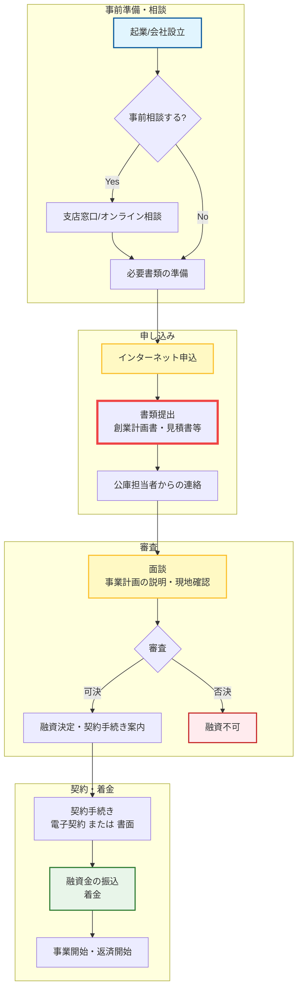

# 融資獲得までのロードマップ

```mermaid
graph TD
    subgraph S1 ["事前準備・相談"]
        A["起業/会社設立"] --> B{"事前相談する?"}
        B -- Yes --> C["支店窓口/オンライン相談"]
        C --> D["必要書類の準備"]
        B -- No --> D
    end

    subgraph S2 ["申し込み"]
        D --> E["インターネット申込"]
        E --> F["書類提出<br/>創業計画書・見積書等"]
        F --> G["公庫担当者からの連絡"]
    end

    subgraph S3 ["審査"]
        G --> H["面談<br/>事業計画の説明・現地確認"]
        H --> I{"審査"}
        I -- "可決" --> J["融資決定・契約手続き案内"]
        I -- "否決" --> Z["融資不可"]
    end

    subgraph S4 ["契約・着金"]
        J --> K["契約手続き<br/>電子契約 または 書面"]
        K --> L["融資金の振込<br/>着金"]
        L --> M["事業開始・返済開始"]
    end

    style A fill:#e1f5fe,stroke:#01579b,stroke-width:2px
    style E fill:#fff9c4,stroke:#fbc02d,stroke-width:2px
    style F stroke:#ef4444,stroke-width:4px
    style H fill:#fff9c4,stroke:#fbc02d,stroke-width:2px
    style L fill:#e8f5e9,stroke:#2e7d32,stroke-width:2px
    style Z fill:#ffebee,stroke:#c62828,stroke-width:2px
```
